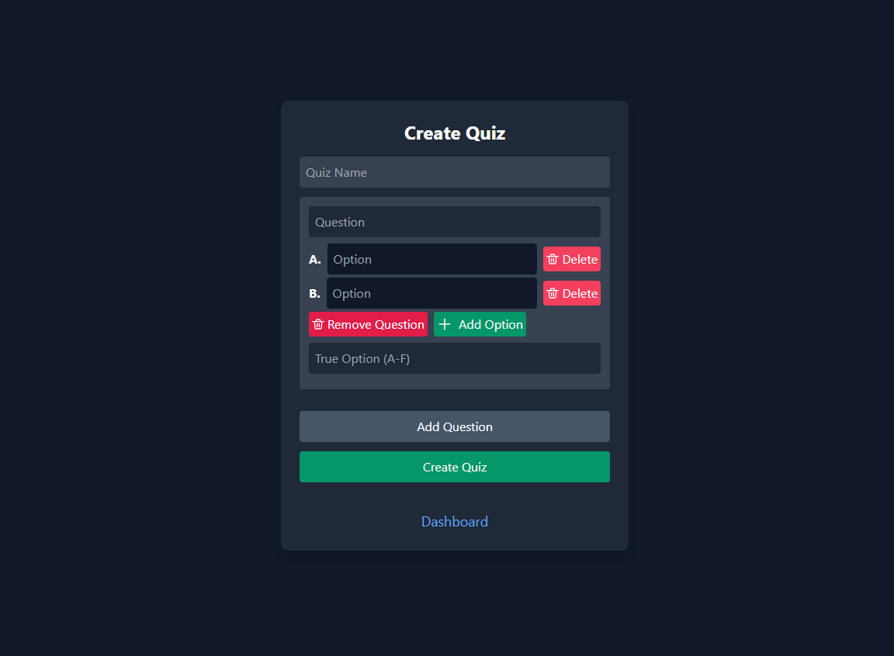
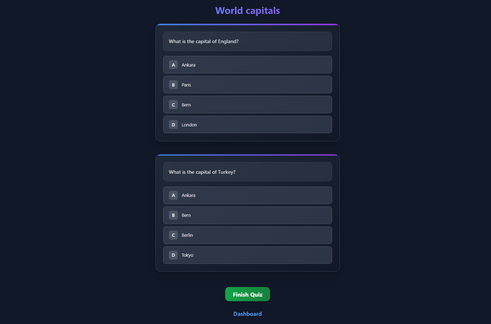
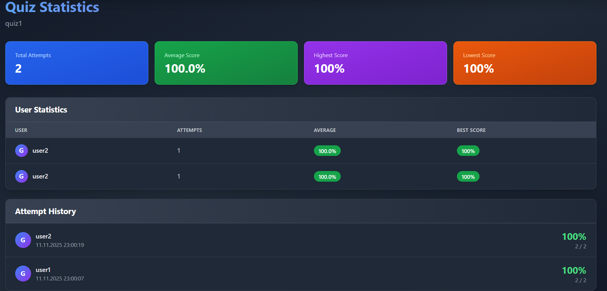
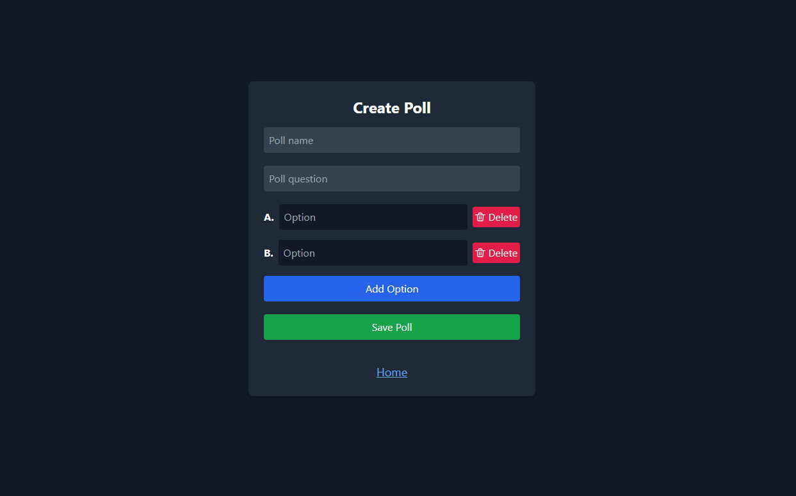
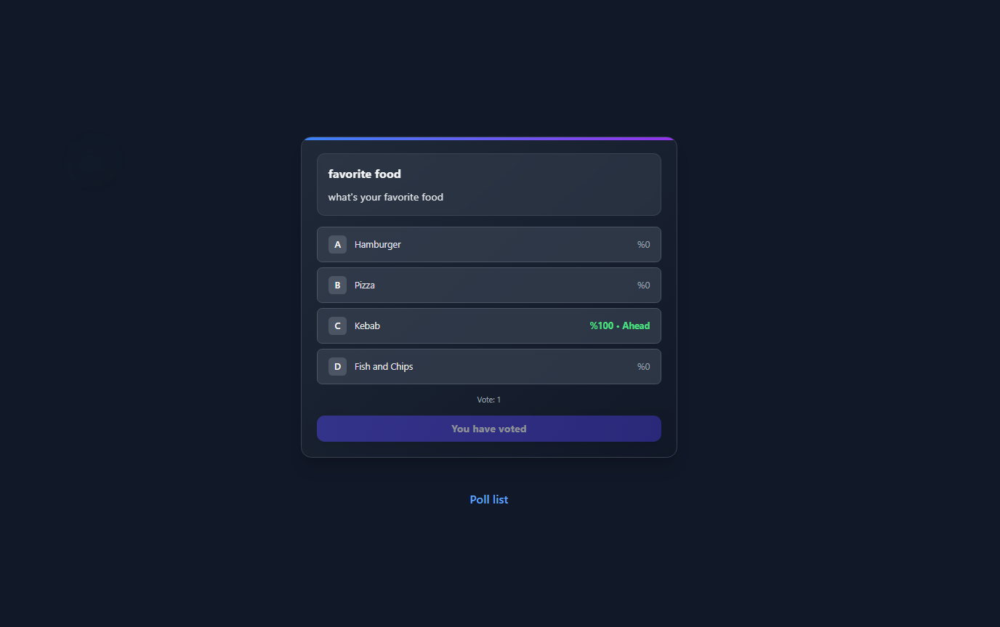
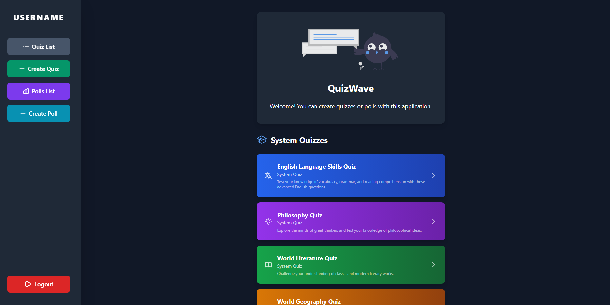

#  QuizWave - Modern Quiz & Poll Platform

A comprehensive full-stack web application designed for creating, managing, and participating in quizzes and polls. Built with a modern tech stack featuring an Express.js RESTful API backend and a responsive Vanilla JavaScript + Tailwind CSS frontend. The application emphasizes user experience with a sleek dark theme, secure JWT-based authentication, Firebase integration for data persistence, and real-time interactive features. Users can easily share quiz and poll links for wider participation across all platforms.


> **Note**: This project is currently in development. Some features like user profiles, quiz analytics, and advanced poll settings are planned for future releases. Screenshots below show the current state of each page interface. I'm sorry for 🍝

## ✨ Features

### 🔗 Link Sharing System
- **Shareable Quiz URLs** - Copy and share quiz links for easy access
- **Poll Distribution** - Generate unique links for poll participation
- **Social Media Ready** - Links work across all platforms and devices

### 🔐 Authentication System
- **Secure Login/Register** with JWT authentication
- **Password Hashing** using bcryptjs
- **Firebase Integration** for user management
- **Session Management** with secure tokens

### 📝 Quiz Management
- **Create Custom Quizzes** with multiple choice questions
- **System Quizzes** including English, Geography, Literature, and Philosophy
- **Interactive Quiz Solving** with real-time feedback
- **Quiz Library** to browse available quizzes
- **Shareable Links** Copy and share quiz URLs with others
- **Quiz Statistics** View detailed performance metrics and user success rates


<table><tr>
  <td align="center" width="50%">
    <br>
    <em>Quiz Creation Page - Interface for building custom quizzes</em>
  </td>
  <td align="center" width="50%">
    <br>
    <em>Quiz Taking Interface - Interactive question answering page</em>
  </td>
</tr></table>

<div align="center">
  
  <br>
  <em>Quiz Statistics Dashboard - Track average scores and user performance</em>
</div>


### 🗳️ Poll System
- **Create Polls** with multiple options
- **Real-time Voting** with instant results
- **Poll Management** and viewing capabilities
- **Interactive Poll Interface**
- **Share Poll Links** - Generate shareable URLs for wider participation


<table><tr>
  <td align="center" width="50%">
    <br>
    <em>Poll Creation Interface - Design and configure new polls</em>
  </td>
  <td align="center" width="50%">
    <br>
    <em>Poll Participation Page - Vote and view live results</em>
  </td>
</tr></table>

### 👥 Admin Panel
- **User Management** - View and manage all registered users
- **Account Control** - Suspend or delete user accounts
- **System Monitoring** - Track platform activity and statistics
- **Administrative Tools** - Comprehensive platform management features

<div align="center">
  
  <br>
  <em>Admin Dashboard - User management and account control interface</em>
</div>


*↳ Main Dashboard - Central hub with navigation and features overview*

## 🚀 Tech Stack

### Backend
- **Node.js** - Runtime environment
- **Express.js** - Web framework
- **Firebase Admin** - Database and authentication
- **JWT** - Token-based authentication
- **bcryptjs** - Password hashing
- **CORS** - Cross-origin resource sharing

### Frontend
- **Vanilla JavaScript** - Core functionality
- **Tailwind CSS** - Utility-first CSS framework
- **HTML5** - Semantic markup
- **SVG Graphics** - Custom illustrations


## 🛠️ Installation & Setup

### Prerequisites
- **Node.js** (v14 or higher)
- **npm** or **yarn**
- **Firebase Account** for database and authentication

### 1️⃣ Clone the Repository
```bash
git clone <repository-url>
cd quiz-app
```

### 2️⃣ Backend Setup
```bash
cd backend
npm install
```

### 3️⃣ Firebase Configuration
1. Create a Firebase project at [Firebase Console](https://console.firebase.google.com/)
2. Generate a service account key
3. Configure `firebase-config.js` with your credentials

### 4️⃣ Start the Backend Server
```bash
npm start
```
The backend server will start on `http://localhost:3000`

### 5️⃣ Frontend Setup
Open `frontend/index.html` in your browser or serve it through a local server.

## 🎯 Usage

### 👤 User Registration & Login
Register or login to access the platform dashboard.

### 📝 Creating & Sharing Quizzes
1. Create custom quizzes with multiple choice questions
2. Copy and share quiz links for easy distribution

### 🗳️ Creating & Sharing Polls
1. Design polls with multiple options and duration settings
2. Share poll URLs to maximize participation

### 📊 Participating in Quizzes/Polls
Browse, participate, and track your progress in available content.

## 🔧 API Endpoints

### Authentication
- `POST /api/auth/register` - User registration
- `POST /api/auth/login` - User login
- `GET /api/auth/verify` - Token verification

### Quiz Management
- `GET /api/quizzes` - Get all quizzes
- `POST /api/quiz/create` - Create new quiz
- `GET /api/quiz/:id` - Get specific quiz
- `POST /api/quiz/solve` - Submit quiz answers
- `GET /api/quiz/share/:id` - Get shareable quiz link

### Poll Management
- `GET /api/polls` - Get all polls
- `POST /api/poll/create` - Create new poll
- `GET /api/poll/:id` - Get specific poll
- `POST /api/poll/vote` - Submit vote
- `GET /api/poll/share/:id` - Get shareable poll link


## 🤝 Contributing

1. Fork the repository
2. Create a feature branch (`git checkout -b feature/AmazingFeature`)
3. Commit your changes (`git commit -m 'Add some AmazingFeature'`)
4. Push to the branch (`git push origin feature/AmazingFeature`)
5. Open a Pull Request

## 📄 License

This project is licensed under the MIT License - see the [LICENSE](LICENSE) file for details.


---

<div align="center">
  <p>🌟 Don't forget to star this repository if you found it helpful! 🌟</p>
</div>
